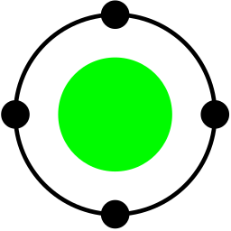

  
<h1 align="center"> TODO APP </h1>
frontend written with javascript and the backen with go

# Frontend Stack
Svelte

# Backend Stack
- Go
- Fiber
- Mgm -> MongoDB

# DEVELOPING
1. clone the repository 
2. install dependencies
`npm install`
`cd frontend && npm install`
`go get`
3. run the project
`npm run dev`
